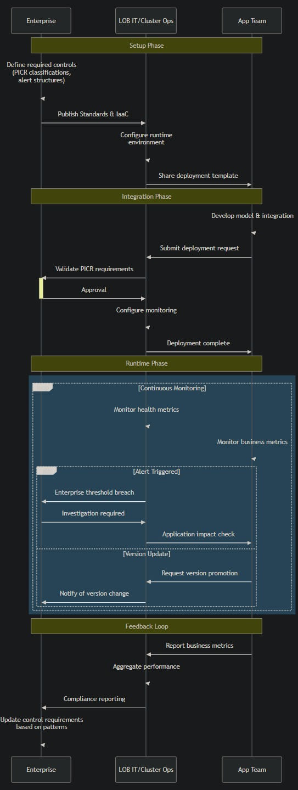
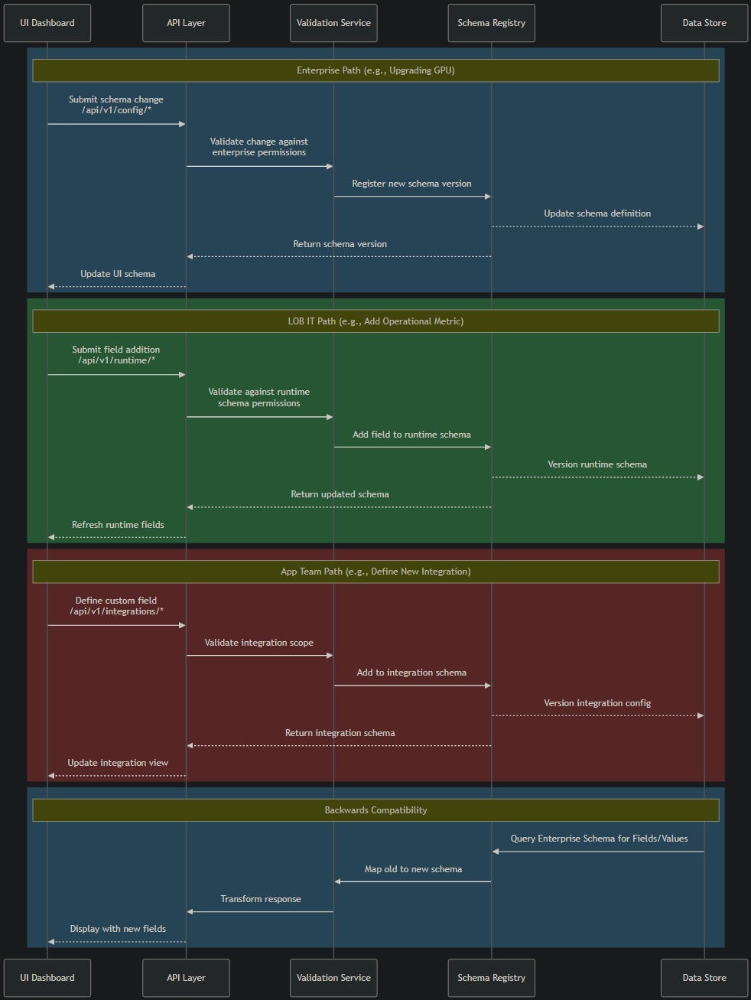

# AI Security Architecture

## via AI Passports

AI security is fundamentally about observability with context. We track inputs, outputs, and model behavior patterns, then compare against established baselines to detect anomalies — logged to a per-integration API with per-deploy specifics and end-to-end configuration details (Yay! SR11-7v2!! Go Governance!!).



---

## Core Components

### 1. Input/Output Logging
- Track prompts, responses, and processing patterns
- Establish baselines of normal vs. abnormal behavior
- Apply data classification (PICR) for appropriate handling

### 2. Real-Time Monitoring
- Compare current behavior against established patterns
- Alert on deviations that exceed thresholds
- Apply lightweight checks broadly, heavier verification selectively

### 3. Verification & Testing
- Validate models against known attack patterns
- Implement continuous security testing
- Maintain audit trails for compliance

### 4. System Breadcrumb

The **System Breadcrumb** is a SHA-256 (or contemporaneous equivalent) hash of the initial `use_case_registry.json`, used as a shared secret for deployment identity verification and auditability. It provides immutable context anchoring for logs and requests.

**Artifacts:**
- `use_case_registry.json` – Source of truth for the AI Passport
- `system_breadcrumb.txt` – Hash artifact derived from the above
- `tool_invocation.log` – Operational log entries referencing the breadcrumb

<details>
<summary><strong>🔐 Python: Generate System Breadcrumb</strong></summary>

```python
# generate_breadcrumb.py
import json, hashlib

def generate_system_breadcrumb(json_path: str) -> str:
    with open(json_path, 'r') as f:
        data = json.load(f)
    encoded = json.dumps(data, sort_keys=True).encode('utf-8')
    breadcrumb = hashlib.sha256(encoded).hexdigest()

    with open('system_breadcrumb.txt', 'w') as out:
        out.write(breadcrumb)

    return breadcrumb

# Example usage:
# python generate_breadcrumb.py
```

</details>

---

## Role-Based Implementation

Each team has clear responsibilities:

- **Enterprise**: Set security standards, define classifications
- **IT/Ops**: Configure runtime environments, validation parameters
- **Application Teams**: Implement controls, monitor business metrics



---

## 🧭 C4 Architecture Views

| View       | Description              | Link                                       |
|------------|--------------------------|--------------------------------------------|
| Context    | High-level system context |            |
| Container  | Deployment components     |        |
| Component  | Key functional elements   |        |
| Code       | Implementation details    |                  |
| Personas   | User/stakeholder roles    |          |

---

## Implementation Resources

- [API Schema Definition](schema.json)
- [Logging Implementation](LoggingAPI.py)
- [Validation Documentation](validation-docs.md)
- `use_case_registry.json` – Defines the deployment’s purpose and scope
- `system_breadcrumb.txt` – Canonical SHA-256 fingerprint
- `tool_invocation.log` – Signed and referenceable activity logs

---

## AI Control Plane API (`LoggingAPI.py`) Usage Examples

This section details how to interact with the AI Control Plane API defined in `LoggingAPI.py`. This API is central to managing the governance schemas for different organizational roles.

**Authentication:**
All API endpoints require an OAuth2 token passed in the `Authorization` header as a Bearer token. Example tokens (for demonstration purposes, replace with actual tokens from your OAuth provider):
*   Enterprise Role Token: `enterprise-token`
*   LOB IT Role Token: `lob-token`
*   App Team Role Token: `app-token`

These tokens correspond to the roles defined in the `get_current_role` function in `LoggingAPI.py`.

### 1. Update Enterprise Schema (`POST /api/v1/config/schema`)
*   **Role Required**: Enterprise
*   **Description**: Updates the enterprise infrastructure schema. This schema defines core standards such as data classification levels and high-level alerting heuristics. It's foundational for overall AI governance.
<details>
<summary><strong>📋 Example Request Body</strong></summary>

```json
{
    "name": "Global AI Usage Policy Framework",
    "targetMetric": "Enterprise Model Compliance Adherence Score",
    "dataClassification": "Confidential",
    "quickAlertHeuristic": {
        "threshold": 0.9,
        "window": "7d"
    },
    "reason": "Q3 update: Aligning with new regulatory guidelines and internal audit recommendations.",
    "policyDocumentVersion": "2.1",
    "affectedRegions": ["Global"]
}
```
</details>
    *Note: The `author` and `timestamp` fields for the schema record are automatically set or updated by the API based on the authenticated user and current time. The `reason` field is optional but recommended for auditability.*

### 2. Update Runtime Schema (`POST /api/v1/runtime/schema`)
*   **Role Required**: LOB IT
*   **Description**: Updates the Line of Business (LOB) IT runtime schema. This schema is crucial for configuring runtime environments and model validation parameters, as depicted in the "Personas and Roles" diagram (`personas.jpg`).
<details>
<summary><strong>📋 Example Request Body</strong></summary>

```json
{
    "modelVersion": "claude-3-sonnet-20240229",
    "validationParameters": {
        "maxInputTokens": 80000,
        "maxOutputTokens": 2000,
        "responseBiasCheck": "enabled",
        "hallucinationDetectionLevel": "moderate"
    },
    "reason": "Setting primary summarization model to Claude 3 Sonnet and adjusting validation parameters for broader use.",
    "computeRegion": "us-west-2",
    "slaTier": "Silver"
}
```
</details>
    *Note: The `author` and `timestamp` fields are automatically set/updated by the API. Additional properties like `computeRegion` or `slaTier` can be included if `additionalProperties` is true for the schema, showcasing its extensibility.*

### 3. Update Integration Schema (`POST /api/v1/integrations/schema`)
*   **Role Required**: App Team
*   **Description**: Updates the application team integration schema. This allows application teams to define custom monitoring thresholds and business-specific metrics, aligning with the end-to-end architecture shown in `end-to-end.jpg`.
<details>
<summary><strong>📋 Example Request Body</strong></summary>

```json
{
    "customThresholds": {
        "average_sentiment_score_min": 0.65,
        "intent_recognition_accuracy_min": 0.90,
        "data_extraction_error_rate_max_percentage": 2.0
    },
    "businessMetric": "CustomerSupportTicketDeflectionRate",
    "reason": "Adjusting thresholds for the support chatbot (Project Nightingale) based on initial performance data.",
    "applicationID": "App002-NightingaleBot",
    "feedbackLoopSystem": "ServiceNow-AISupport"
}
```
</details>
    *Note: The `author` and `timestamp` fields are automatically set/updated by the API. Fields like `applicationID` are examples of custom additions.*

### 4. Get Audit Log (`GET /api/v1/audit/{schema_type}`)
*   **Role Required**: Any authenticated role (Enterprise, LOB IT, App Team).
*   **Description**: Retrieves the audit log for changes made to a specific schema type (`enterprise`, `runtime`, or `integration`). This is vital for compliance, troubleshooting, and tracking the evolution of governance configurations. For example, it can show how the list of deployed system APIs within the enterprise schema has evolved.
*   **Example Request**:
    `GET /api/v1/audit/enterprise`
    (Requires appropriate authentication token in the `Authorization` header)
<details>
<summary><strong>📋 Example Response Body</strong></summary>

```json
{
    "changes": [
        {
            "timestamp": "2024-06-03T14:30:00Z",
            "schema_type": "enterprise",
            "author": "enterprise-enterprise",
            "change": {
                "name": "Global AI Usage Policy Framework",
                "targetMetric": "Enterprise Model Compliance Adherence Score",
                "dataClassification": "Confidential",
                "quickAlertHeuristic": {
                    "threshold": 0.9,
                    "window": "7d"
                },
                "reason": "Q3 update: Aligning with new regulatory guidelines and internal audit recommendations.",
                "policyDocumentVersion": "2.1",
                "affectedRegions": ["Global"],
                "author": "enterprise-enterprise",
                "timestamp": "2024-06-03T14:30:00Z"
            }
        },
        {
            "timestamp": "2024-06-01T10:15:00Z",
            "schema_type": "enterprise",
            "author": "enterprise-enterprise",
            "change": {
                "name": "Enterprise Policy - API Inventory Update",
                "targetMetric": "API Deployment Coverage",
                "dataClassification": "Internal",
                "quickAlertHeuristic": {
                    "threshold": 3,
                    "window": "30d"
                },
                "reason": "Adding system API inventory to enterprise schema.",
                "deployedSystemAPIs": [
                    {"apiName": "AuthenticationService", "version": "v2.1", "status": "active", "lastUpdate": "2024-05-28"},
                    {"apiName": "PaymentGateway", "version": "v1.5", "status": "active", "lastUpdate": "2024-05-15"},
                    {"apiName": "NotificationService", "version": "v3.0", "status": "beta", "lastUpdate": "2024-06-01"}
                ],
                "author": "enterprise-enterprise",
                "timestamp": "2024-06-01T10:15:00Z"
            }
        }
    ]
}
```
</details>

---

## Business Benefits

- **Compliance**: Meet regulatory requirements with audit trails
- **Security**: Detect and mitigate novel AI-specific threats
- **Operational**: Faster incident response with clear accountability

---

## Getting Started

1. Define your Tools & Sensitivity (`tool_invocation.log`)
2. Create a use case registry entry (`use_case_registry.json`)
3. Generate your system breadcrumb **Artifacts:** (`system_breadcrumb.txt`)
4. Attach breadcrumb ID to all Sensitive Tool Invocation logs; Log to the API

---

## Additional Resources

- [Original Architecture Overview](a16zSummary.png)
- [Detailed Architecture](a16zDetail.png)
- [Annotated Architecture](a16zDetailAnnotated.png)
- [LLMs and Observability (Video)](LLMs%20x%20Observability.mp4)

---
```
