# 📊 Data Classification & Monitoring Service
###### Policy-Driven, VLM-Enhanced, Local-First

This document describes `classify.py`, a Data Classification and Monitoring Service that delivers a plug-and-play validation layer for any application processing structured data (e.g., JSON objects). By routing data through a simple API endpoint, you can enforce complex policies for data sensitivity, content validity, and multi-modal compliance before it is stored or returned to a user.

---

### The Zero-Trust Validation Lifecycle

At its core, the service treats all incoming data as untrusted. Each request passes through a dynamic, policy-driven validation gauntlet where different AI models and rule engines are invoked based on the policy's requirements. This ensures that every piece of data is explicitly verified before receiving a "PASS" status.

<details>
<summary><strong>🗺️ Click to view the step-by-step</strong></summary>

This diagram illustrates the internal decision-making process for the `/service/validate` endpoint.

```mermaid
---
config:
  flowchart:
    defaultRenderer: "elk"
    elk:
      "elk.algorithm": "layered"
      "elk.direction": "DOWN"
      "layered.spacing.nodeNodeBetweenLayers": "80"
      "spacing.nodeNode": "20"
---
graph TD
    %% --- VAPORWAVE AESTHETIC / STRAIGHT-LINE CONFIG ---
    classDef default fill:#1a1a2e,stroke:#00ffff,color:#ffffff,font-family:monospace
    classDef decision fill:#111,stroke:#00ffff,stroke-width:1.5px,rx:0,ry:0,color:#e0e0e0
    classDef model fill:transparent,stroke:transparent,color:#ff00c1,font-weight:bold
    classDef rag fill:transparent,stroke:transparent,color:#00ff9f,font-weight:bold
    classDef external fill:transparent,stroke:transparent,color:#9a9aef
    classDef pass fill:transparent,stroke:transparent,color:#39ff14,font-weight:bold
    classDef reject fill:transparent,stroke:transparent,color:#ff3366,font-weight:bold
    classDef process fill:#2a2a3e,stroke:#505070,rx:0,ry:0
    classDef flow fill:transparent,stroke:transparent,color:#fff
    linkStyle default stroke:#00ffff,stroke-width:2px

    %% --- WORKFLOW: Structured for straight lines ---
    A(API Request):::flow --> B{Policy Lookup}
    
    B --> C{I/O Validation?}
    C -- no --> F
    C -- yes --> D(ModernBERT):::model
    D --> F{Sensitivity Check?}
    
    F -- no --> H
    F -- yes --> G(ColBERT):::model
    G --> H{Multimodal Item?}

    H -- no --> J
    H -- yes --> I(VLM Processor):::model
    I --> J(Aggregate Results):::process

    J --> K{Evaluate Policy Rules}
    K -- "No Violations" --> L(PASS):::pass
    K -- "Violation" --> M{Contextual Help?}
    
    L --> P
    
    M -- "no" --> O(REJECT):::reject
    M -- "yes" --> N(Query RAG Index):::rag
    N --> Q(Format Suggestions):::process
    Q --> O
    
    O --> P(API Response):::flow

    %% --- EXTERNAL COMPONENTS ---
    subgraph " "
        Client([API Client]):::external -. "sends" .-> A
        P      -. "returns" .-> Client
        PolicyDb[(Policy Config)]:::external -. "informs" .-> B
        RAGDb[(RAG Index)]:::external -. "informs" .-> N
    end

    %% --- Apply Classes ---
    class A,P flow
    class B,C,F,H,K,M decision
```



</details>

---

### Key Features

* **Drop-in Integration**: A single `/service/validate` endpoint handles all validation logic.

* **Policy-Driven**: Configure complex validation rules via external JSON files. No code changes needed to update policies.

* **Natively Multi-Modal**: VLM support enables deep analysis of images, with video and other modalities planned.

* **Zero-Trust VLM Handshake**: Multi-step protocol for multimodal data; prevents persistence of sensitive data (e.g., PII via ID)

* **Context-Aware Help**: Provides developers with relevant documentation snippets when a policy violation occurs, powered by RAG.

---

### Policy Example: Strict PII Detection

The service is configured through policies. The following is a simple policy that enables a sensitivity check and rejects any input text classified as containing Personally Identifiable Information (PII).

<details>
<summary><strong>🔐 Click to expand PII Policy example</strong></summary>

In your `policy_config.json`:

```json
{
  "StrictPIIPolicy": {
    "description": "Focuses on identifying and rejecting PII in input text.",
    "modernbert_io_validation": false,
    "colbert_input_sensitivity": true,
    "disallowed_colbert_input_classes": ["Class 1: PII"],
    "documentation_assistance": {
      "enabled": true,
      "index_path": "./tool_examples/internal_data_handling_docs_rag",
      "max_total_suggestions": 2
    }
  }
}
```

*   **`colbert_input_sensitivity`**: Enables the sensitivity analysis model.
*   **`disallowed_colbert_input_classes`**: Defines which sensitivity classes should trigger a violation.
*   **`documentation_assistance`**: Provides contextual help from a specified RAG index when a PII violation occurs.

</details>

---

### API Endpoints

*   `POST /service/validate` — The main policy-driven validation endpoint.
*   `POST /modernbert/classify` — Direct access to the I/O Validator model.
*   `POST /colbert/classify_sensitivity` — Direct access to the Sensitivity Classifier model.
*   `GET /status` — Check service and component health.

---

### Getting Started

1.  **Generate Examples & RAG Index**
    This command creates sample policies and documentation, then builds a RAG index so the service can provide helpful violation messages.
    ```bash
    # This will create files in ./my_service_examples
    python classify.py create-example --output-dir ./my_service_examples --auto-build-docs-rag
    ```

2.  **Start the API Server**
    Point the server to the generated policy configuration.
    ```bash
    python classify.py serve --policy-config-path ./my_service_examples/enhanced_policy_config.json
    ```

3.  **Send a Test Request**
    Invoke a policy by referencing its name in the `api_class` field. This example sends text that will be flagged as PII.
    ```bash
    curl -X POST http://localhost:8080/service/validate \
      -H "Content-Type: application/json" \
      -d '{
        "api_class": "StrictPIIPolicy",
        "input
